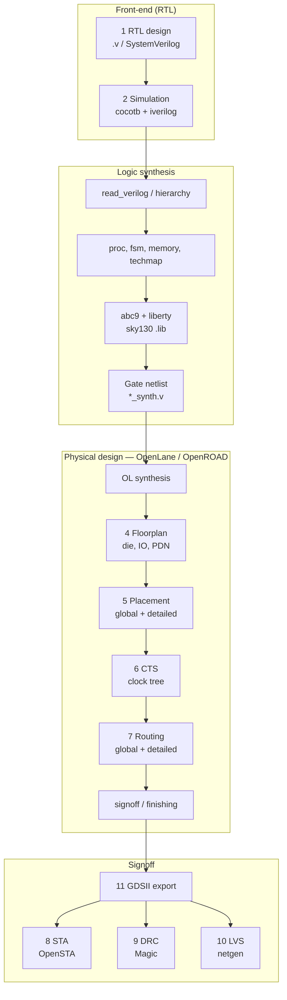

# Chip Design MCP — Architecture

**Magazine chapter:** technical cutaway of the yacht — see [DREAMING_IN_SILICON.md](DREAMING_IN_SILICON.md) for why this diagram exists.

## Overview

Chip Design MCP orchestrates the open-source RTL-to-GDSII ASIC flow through
MCP tools. It does **not** implement any EDA algorithms — it coordinates
industry-standard open-source tools as subprocesses and exposes their
capabilities through a FastMCP 3.2 interface.

## Execution Model

```
                    ┌─────────────────────────────┐
                    │   FastMCP 3.2 + FastAPI      │
                    │   (port 11022)               │
                    └──────────┬──────────────────┘
                               │
            ┌──────────────────┼──────────────────┐
            │                  │                  │
     ┌──────▼──────┐   ┌──────▼──────┐   ┌──────▼──────┐
     │   yosys     │   │  iverilog   │   │   Docker    │
     │  (synthesis)│   │  + cocotb   │   │  (OpenLane) │
     └─────────────┘   └─────────────┘   └─────────────┘
```

All execution is via `asyncio.create_subprocess_exec`. No persistent
daemons required (Docker for OpenLane is the exception).

## Tool Registration Pattern

Each domain module defines a `register_*_tools(mcp, **deps)` function:

```python
def register_synthesis_tools(mcp, state, run_eda, work_dir, output_dir, upload_dir):
    @mcp.tool(annotations={"readonly": True}, version="0.1.0")
    async def syn_run(top_module: Annotated[str, Field(...)]) -> dict:
        ...
    return {"syn_run": syn_run, ...}
```

The server calls all registration functions after creating the FastMCP instance.
Dependencies (state dict, subprocess runner, directories) are passed through
the registration functions — no global state in tool modules.

## REST API

All MCP tools are also exposed via REST for webapp consumption:

- `GET  /api/v1/status` — server health
- `GET  /api/v1/tools` — list registered tools
- `POST /api/v1/control/{tool_name}` — invoke any tool via JSON body
- `POST /api/v1/upload` — upload a design file
- `GET  /api/v1/list?dir=uploads|outputs|designs` — list files
- `GET  /api/v1/download/{file_name}?dir=outputs` — download artifact

## Complete EDA pipeline (RTL → GDSII)

Chip Design MCP mirrors the industry **RTL-to-GDSII** flow. Stages 1–11 match `chip_pipeline_stages` and the webapp **Pipeline** Prefab card. Physical steps 4–7 and final GDS are normally run inside **OpenLane** (`pr_run_flow`); stages 3, 8–10 can also be invoked standalone via MCP tools.

### End-to-end flow (ASCII)

```
  Spec / template
        |
        v
  [1] RTL (.v) ................. depot_init, editor, POST /api/v1/upload
        |
        v
  [2] Functional sim ........... cocotb + iverilog (sim_run_testbench) -> pass/fail, .vcd
        |
        +------------------+------------------+
        v                  v                  v
  [3] Logic synthesis   (optional parallel)   cells_* (library browse)
      Yosys syn_*           verify_formal
        |
        v
  [4-7] Physical design ....... OpenLane pr_run_flow (OpenROAD inside Docker/native)
        |     synthesis -> floorplan -> placement -> CTS -> routing -> signoff
        v
  [8] STA ...................... OpenSTA verify_timing (also reports inside OpenLane)
        |
        v
  [9] DRC ...................... Magic verify_drc
        |
        v
  [10] LVS ..................... netgen verify_lvs
        |
        v
  [11] GDSII ................... pr_export_gds (.gds) -> fabrication (see FABRICATION_AND_FABS.md)
```

### Pipeline diagram (Mermaid)



### Eleven stages (catalog)

Same order as `chip_pipeline_stages` / `show_pipeline_card`:

| # | Stage | Engine | Primary MCP tools | Typical inputs | Typical outputs |
|---|-------|--------|-------------------|----------------|-----------------|
| 1 | RTL design | Editor / depot | `depot_init`, upload API | Spec, template | `*.v` in work dir |
| 2 | Simulation | cocotb, iverilog | `sim_list_tests`, `sim_run_testbench`, `sim_read_waveform` | RTL + `test_*.py` | Pass/fail, `.vcd` |
| 3 | Logic synthesis | Yosys | `syn_read_verilog`, `syn_run`, `syn_stats`, `syn_export_netlist` | RTL, `.lib` | `*_synth.v`, stat JSON |
| 4 | Floorplan | OpenLane → OpenROAD | `pr_create_design`, `pr_configure`, `pr_run_flow` (`from_stage=floorplan`) | Netlist, LEF, SDC | `floorplan.def` |
| 5 | Placement | OpenROAD | `pr_run_flow` (`placement`) | Floorplan, SDC | `placement.def` |
| 6 | CTS | OpenROAD | `pr_run_flow` (`cts`) | Placed design | `cts.def` |
| 7 | Routing | OpenROAD | `pr_run_flow` (`routing`) | CTS, SDC | Routed DEF, SPEF |
| 8 | STA | OpenSTA | `verify_timing`, `pr_read_reports` | Netlist/DEF, liberty, SDC | `timing.rpt` |
| 9 | DRC | Magic | `verify_drc` | GDS, PDK tech | DRC report (heuristic parse) |
| 10 | LVS | netgen | `verify_lvs` | GDS + SPICE/netlist | LVS report |
| 11 | GDSII | OpenLane | `pr_run_flow` (`signoff`), `pr_export_gds`, `pr_export_lef` | Routed layout | `*.gds`, `*.lef` |

**Note:** Running `pr_run_flow` without `from_stage` executes OpenLane stages **3–11 in one job** (embedded Yosys synthesis through GDS). Standalone `syn_*` is for iterative RTL tuning before committing to a long OpenLane run.

### Stage 2 — Simulation (detail)

| Step | Binary | MCP |
|------|--------|-----|
| Discover tests | — | `sim_list_tests` |
| Compile RTL | `iverilog` | inside `sim_run_testbench` |
| Run cocotb | `python` + cocotb | `sim_run_testbench` |
| Waveform | `vvp` | `.vcd` in work dir |
| Inspect signals | parse VCD header | `sim_read_waveform` (metadata only today) |
| Coverage scan | — | `sim_check_coverage` |

### Stage 3 — Yosys synthesis (detail)

Script built by `syn_run` (see `synthesis.py`):

| Order | Yosys command | Purpose |
|-------|---------------|---------|
| 1 | `read_verilog` | Load staged RTL |
| 2 | `hierarchy -top` | Elaborate top |
| 3 | `flatten` (optional) | Flatten hierarchy |
| 4 | `proc; opt` | Processes → gates |
| 5 | `fsm; opt` | FSM extraction |
| 6 | `memory; opt` | Memory inference |
| 7 | `techmap; opt` | Technology mapping |
| 8 | `dfflibmap` + `abc9` (sky130) | Map to standard cells with `.lib` |
| 9 | `stat -json` | Area/cell counts |
| 10 | `write_verilog` | Gate netlist to `output/` |

Visualization: `syn_show` (dot → graphviz). Alternate checks: `verify_formal` (Yosys equivalence smoke).

### Stages 4–7 + 11 — OpenLane physical flow (detail)

`pr_run_flow` drives OpenLane; `from_stage` may be `synthesis`, `floorplan`, `placement`, `cts`, `routing`, or `signoff` for incremental reruns.

| OpenLane stage | OpenROAD / tool role | Artifacts (under `designs/<name>/`) |
|----------------|----------------------|--------------------------------------|
| Synthesis | Yosys + ABC (PDK liberty) | Synthesized netlist, constraints |
| Floorplan | Die size, IO placement, tapcell, PDN | Initial DEF |
| Placement | Global + detailed placement | `placement.def` |
| CTS | Clock tree synthesis | `cts.def` |
| Routing | Global + detailed route | Routed DEF, SPEF |
| Signoff / finishing | Fill, antenna, final checks | Reports, stream-out prep |
| GDS export | Magic stream-out (via flow) | `*.gds` — copy with `pr_export_gds` |

Supporting tools: `pr_status` (Docker/native/PDK), `pr_create_design`, `pr_configure` (clock, density, SDC paths in `config.json`), `pr_read_reports` (timing/area/DRC excerpts).

Execution: `_run_openlane` → Docker image `ghcr.io/the-openroad-project/openlane:latest` or native `openlane` CLI; timeout up to 3600s.

### Stages 8–10 — Verification (detail)

Often run **after** `pr_export_gds`; OpenLane may already emit overlapping reports — MCP tools allow ad-hoc reruns on exported artifacts.

| Stage | Tool | Engine | Inputs |
|-------|------|--------|--------|
| 8 STA | `verify_timing` | OpenSTA | Top module, liberty (sky130 fallback from `PDK_ROOT`), optional SDC |
| 9 DRC | `verify_drc` | Magic | GDS + tech from PDK |
| 10 LVS | `verify_lvs` | netgen | GDS + SPICE/netlist |
| — | `verify_formal` | Yosys | RTL equivalence (pre-layout) |

Violation counts from DRC/LVS are **stdout heuristics**, not foundry signoff databases.

### Standard cells and depot (pipeline inputs)

| Area | Tools | Role in pipeline |
|------|-------|------------------|
| Depot | `depot_init`, `depot_list`, `depot_status` | Seed RTL + cocotb tests (counter, alu, fsm) |
| Cells | `cells_list`, `cells_info`, `cells_search`, `cells_stats` | Explore PDK libraries before/at synthesis |
| System | `chip_status`, `chip_pipeline_stages`, `chip_available_pdks` | Discovery and ordering |
| Agent | `chip_agentic` | Multi-step orchestration (host sampling) |

### Work directory layout (artifacts)

Default root: `%TEMP%\chip_design_mcp_work` (`CHIP_DESIGN_MCP_WORK_DIR`).

| Subdir | Pipeline role |
|--------|----------------|
| `uploads/` | Incoming RTL |
| `output/` | Yosys netlists, exported GDS copies, reports |
| `designs/` | OpenLane project trees (`config.json`, runs/, reports/) |

### Recommended agent order

1. `chip_status` — what is installed (yosys, docker, PDK)?
2. `depot_init` or upload RTL
3. `sim_run_testbench` — functional pass
4. `syn_*` — optional fast iteration
5. `pr_create_design` → `pr_configure` → `pr_run_flow`
6. `pr_read_reports` → `pr_export_gds`
7. `verify_drc` / `verify_lvs` / `verify_timing`

Query order anytime: `chip_pipeline_stages`.

## PDK Support

PDKs are installed via volare into `$PDK_ROOT`:

| PDK | Node | Library |
|-----|------|---------|
| sky130 | 130nm | sky130_fd_sc_hd |
| gf180mcu | 180nm | gf180mcu_fd_sc_mcu7t5v0 |
| ihp-sg13g2 | 130nm BiCMOS | sg13g2_stdcell |

## Related documents

| Doc | Role |
|-----|------|
| [INSTALL.md](../INSTALL.md) | Operator install (automated Windows) |
| [PRD.md](PRD.md) | Product requirements |
| [EXTENSION_PLAN.md](EXTENSION_PLAN.md) | Roadmap phases |
| [FOSS_EDA_ECOSYSTEM.md](FOSS_EDA_ECOSYSTEM.md) | Open tools to author RTL and implement (2026) |
| [FOSS_RTL_SOURCES.md](FOSS_RTL_SOURCES.md) | Third-party Verilog repositories |
| [DREAMING_IN_SILICON.md](DREAMING_IN_SILICON.md) | Project ethos, KiCad epilogue, warnings |
